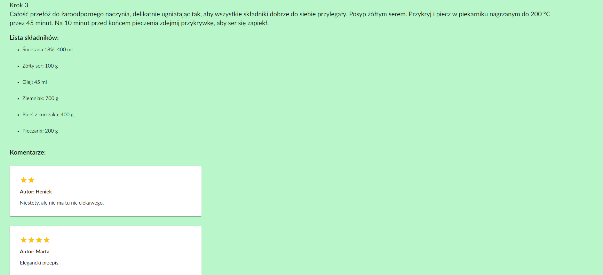
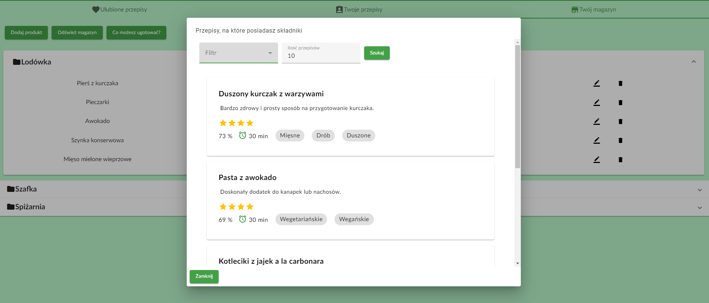

<h1>
  LifeWithFood - Design and implementation of a web application recommending culinary recipes 
</h1>
 

<!-- TABLE OF CONTENTS -->

  
Table of Contents

  <ol>
    <li>
      <a href="#about-the-project">About The Project</a>
      <ul>
        <li><a href="#built-with">Built With</a></li>
      </ul>
    </li>
    <li>
      <a href="#features">Features</a>
    </li>
    <li>
      <a href="#getting-started">Getting Started</a>
    </li>
    <li><a href="#screenshots">Screenshots</a></li>
    <li><a href="#license">License</a></li>
  </ol>

<!-- ABOUT THE PROJECT -->
## About The Project

LifeWithFood is web application that helps create web page with culinary recipes and have recomendation based on food products owned by users.

### Built With
* ASP.NET
* Angular
* EntityFramework
* NodeJS

<!-- FEATURES -->
## Features
* User authentication and authorization
* ORM Connection to database 
* Recipes can be filtered by tags
* User profile with list of favorite recipes, recipe creator and storeroom for groceries
* Recipes recommendation based on owned by user groceries
* Shoplist generator
* Administrator panel

<!-- GETTING STARTED -->
## Getting Started

SQL script to create database is in Create DataBase.sql file. To set connection to database you need to set Default Connection in appsettings.json file.

<!-- SCREENSHOTS -->
## Screenshots
MainPage:
  
LoginPage:
  
ProfilePage:

RecipePage:

Recommendation:

Shoplift:

StoreroomPage:

AdminPage:

<!-- LICENSE -->
## License

Distributed under the MIT License. See `LICENSE.txt` for more information.

(<a href="#readme-top">back to top</a>)

